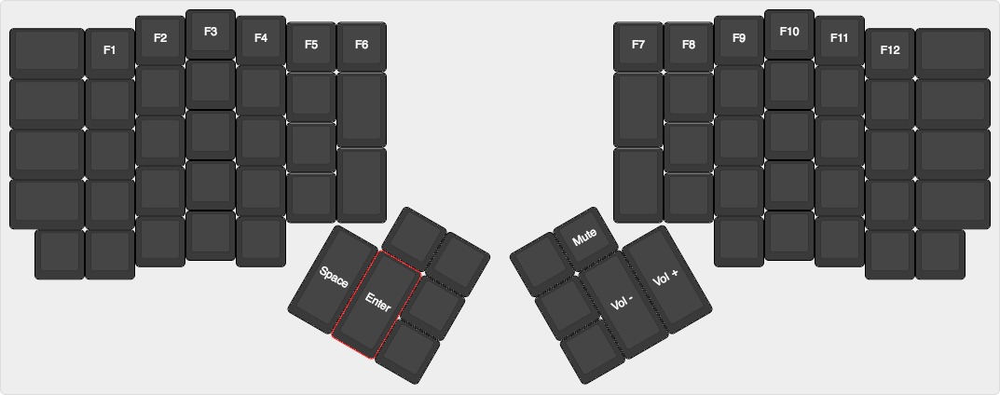

# ErgoDox EZ Default Configuration
## Layout

### [Layer 0](http://goo.gl/hzV8tn)

### [Layer 1](http://goo.gl/cEbdHQ)

### [Layer 2](http://goo.gl/FvFnuI)

### [Layer 3](http://goo.gl/HafC6A)

## Changelog

* Apr 24, 2016:
  * ymotongpoo totally changed its default from original.

* Feb 2, 2016 (V1.1): 
  * Made the right-hand quote key double as Cmd/Win on hold. So you get ' when you tap it, " when you tap it with Shift, and Cmd or Win when you hold it. You can then use it as a modifier, or just press and hold it for a moment (and then let go) to send a single Cmd or Win keystroke (handy for opening the Start menu on Windows).

This is what we ship with out of the factory. :) The image says it all:

